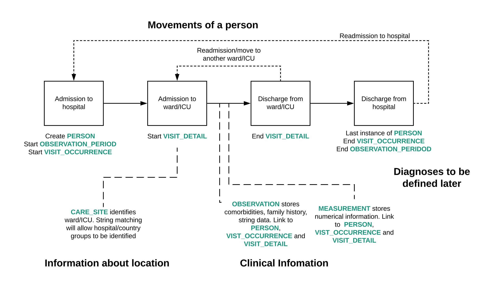

<style type="text/css">

h1.title {
  font-size: 38px;
  text-align: center;
}
h4.date {
  font-size: 18px;
  text-align: center;
}
</style>

```{r, setup, include = FALSE}
library(knitr)
library(ggplot2)
library(dplyr)
library(tidyr)
library(stringr)
library(readr)
library(DBI)
library(lubridate)
library(purrr)
library(glue)
library(patchwork)

knitr::opts_chunk$set(
  collapse = TRUE,
  comment = "#>",
  echo = FALSE, warning = FALSE, error = FALSE, message = FALSE,
  out.width = "100%",
  dpi = 300
)

if(params$local_hospital == "CCAA"){
  ccaa <- TRUE
} else{
  ccaa <- FALSE
}
```


```{r prepare-st}

ctn <- setup_ctn(params)

period_person_ids <- get_period_patients(ctn, params$schema, params$start_date, params$end_date)

observation_period <- tbl(ctn, in_schema(params$schema, "observation_period")) %>% as_tibble()
observation_period <- observation_period %>%
  filter(person_id %in% period_person_ids)

visit_detail <- tbl(ctn, in_schema(params$schema, "visit_detail")) %>%
  as_tibble() %>%
  filter(person_id %in% period_person_ids)

measurements <- tbl(ctn, in_schema(params$schema, "measurement")) %>%
  as_tibble() %>%
  filter(person_id %in% period_person_ids)

st <- prepare_tables(ctn, params$schema) %>%
  map(~
    filter(., person_id %in% period_person_ids))

overview <- prepare_overview(st)
care_sites <- unique(st[["person"]]$care_site_id)

measure_bounds <- read_csv(file = system.file("data", "measure_bounds.csv", package = "ccaa.inspectEHR"))

glossary <- read_csv(file = system.file("data", "glossary.csv", package = "ccaa.inspectEHR"))
```
<br>
<font size="4"> Reporting Period : `r {params$start_date}` to `r {params$end_date}` </font> 

<br>
<br>


```{r, eval = ccaa, width=100, height=25}
asis_output("## OMOP Structure at `r {params$local_hospital}`\\n") 

```

<br>

## Glossary
```{r}
glossary %>%
  print_large_kable() %>%
  column_spec(1, width = "25%") %>%
  column_spec(2:ncol(glossary), width = "75%")
```


```{r}
clinical_tbls <- prepare_tally(ctn, params$schema, filter_person_ids = period_person_ids, filter_care_sites = care_sites)

zero_vals <- clinical_tbls %>%
  filter(n == 0) %>%
  select(table) %>%
  pull()
```
<br>
<br>

## Person Table

```{r}
data_qual_df <- data.frame(matrix(ncol = 4, nrow = 0))
colnames(data_qual_df) <- c("Check", "Number of entries", "Status", "If check fails : n(%)")
```

```{r ages}
if ("person" %in% zero_vals) {
  cat("There is no data in the person table")
} else {
  check_age <- (min(overview$age, na.rm = TRUE) >= 0) && (max(overview$age, na.rm = TRUE) <= 120)
  check <- "Age is between 0 and 120 in years"
  if (check_age) {
    data_qual_df <- add_new_check(data_qual_df, nrow(overview), check, "Pass", "0", "0")
  } else {
    fail_count <- overview %>%
      filter(age < 0) %>%
      nrow()
    fail_percentage <- format(round(fail_count / nrow(overview) * 100, 4), scientific = FALSE)
    data_qual_df <- add_new_check(data_qual_df, nrow(overview), check, "Fail", fail_count, fail_percentage)
  }
}
```

```{r check duplicate person source values}

duplicates <- find_duplicates(st[["person"]], "person_source_value")
check <- "Person source value is not duplicated"
if (nrow(duplicates) > 0) {
  fail_count <- nrow(duplicates)
  fail_percentage <- format(round(fail_count / nrow(st[["person"]]) * 100, 4), scientific = FALSE)
  data_qual_df <- add_new_check(data_qual_df, nrow(st[["person"]]), check, "Fail", fail_count, fail_percentage)
} else {
  data_qual_df <- add_new_check(data_qual_df, nrow(st[["person"]]), check, "Pass", "0", "0")
}
```

```{r check all person ids available in other tables}

unavailable <- check_id_availability(st[["person"]], "person_id", st[["visit_occurrence"]], "person_id")
check <- "All person IDs have a visit occurrence recorded"
if (nrow(unavailable) > 0) {
  fail_count <- nrow(unavailable)
  fail_percentage <- format(round(fail_count / nrow(st[["person"]]) * 100, 4), scientific = FALSE)
  data_qual_df <- add_new_check(data_qual_df, nrow(st[["person"]]), check, "Fail", fail_count, fail_percentage)
} else {
  data_qual_df <- add_new_check(data_qual_df, nrow(st[["person"]]), check, "Pass", "0", "0")
}

unavailable <- check_id_availability(st[["person"]], "person_id", observation_period, "person_id")
check <- "All person IDs have an observation period recorded"
if (nrow(unavailable) > 0) {
  fail_count <- nrow(unavailable)
  fail_percentage <- format(round(fail_count / nrow(st[["person"]]) * 100, 4), scientific = F)
  data_qual_df <- add_new_check(data_qual_df, nrow(st[["person"]]), check, "Fail", fail_count, fail_percentage)
} else {
  data_qual_df <- add_new_check(data_qual_df, nrow(st[["person"]]), check, "Pass", "0", "0")
}

unavailable <- check_id_availability(st[["person"]], "person_id", visit_detail, "person_id")
check <- "All person IDs have an visit detail recorded"
if (nrow(unavailable) > 0) {
  fail_count <- nrow(unavailable)
  fail_percentage <- format(round(fail_count / nrow(st[["person"]]) * 100, 4), scientific = F)
  data_qual_df <- add_new_check(data_qual_df, nrow(st[["person"]]), check, "Fail", fail_count, fail_percentage)
} else {
  data_qual_df <- add_new_check(data_qual_df, nrow(st[["person"]]), check, "Pass", "0", "0")
}
```

```{r check year of birth}

st[["person"]]$date_year <- as.Date(ISOdate(st[["person"]]$year_of_birth, 1, 1))

ghost_birth_year_with_obs <- check_date_within(st[["person"]], "year_of_birth", observation_period, "observation_period_start_date", ">=")

check <- "Year of birth is the same or earlier than the observation start date"
if (nrow(ghost_birth_year_with_obs) > 0) {
  fail_count <- nrow(ghost_birth_year_with_obs)
  fail_percentage <- format(round(fail_count / nrow(st[["person"]]) * 100, 4), scientific = F)
  data_qual_df <- add_new_check(data_qual_df, nrow(st[["person"]]), check, "Fail", fail_count, fail_percentage)
} else {
  data_qual_df <- add_new_check(data_qual_df, nrow(st[["person"]]), check, "Pass", "0", "0")
}

ghost_birth_year_with_today <- check_date_within(st[["person"]], "year_of_birth", compare_date = Sys.Date(), check_arg = ">=")

check <- "Year of birth is the same or earlier than the current date"
if (nrow(ghost_birth_year_with_today) > 0) {
  fail_count <- nrow(ghost_birth_year_with_today)
  fail_percentage <- format(round(fail_count / nrow(st[["person"]]) * 100, 4), scientific = F)
  data_qual_df <- add_new_check(data_qual_df, nrow(st[["person"]]), check, "Fail", fail_count, fail_percentage)
} else {
  data_qual_df <- add_new_check(data_qual_df, nrow(st[["person"]]), check, "Pass", "0", "0")
}
```


```{r print person table checks}

data_qual_df %>%
  print_large_kable() %>%
  column_spec(1, width = "55%") %>%
  column_spec(2:ncol(glossary), width = "15%")
```
<br>
<br>

## Observation Period Table

```{r}
data_qual_Obs_p <- data.frame(matrix(ncol = 4, nrow = 0))
colnames(data_qual_Obs_p) <- c("Check", "Number of entries", "Status", "If check fails : n(%)")
```


```{r check uniqueness of ID varibales}

# uniquness of observation_period_id over the person_id, start_date and end_date

duplicates <- find_duplicates(observation_period, c("observation_period_id", "person_id", "observation_period_start_date", "observation_period_end_date"))
check <- "Observation period ID is unique based on person ID, observation start date and end date"
if (nrow(duplicates) > 0) {
  fail_count <- nrow(duplicates)
  fail_percentage <- format(round(fail_count / nrow(observation_period) * 100, 4), scientific = F)
  data_qual_Obs_p <- add_new_check(data_qual_Obs_p, nrow(observation_period), check, "Fail", fail_count, fail_percentage)
} else {
  data_qual_Obs_p <- add_new_check(data_qual_Obs_p, nrow(observation_period), check, "Pass", "0", "0")
}
```

```{r obervation period start date & enad date check}

ghost_obs_today <- check_date_within(observation_period, "observation_period_start_date", compare_date = Sys.Date(), check_arg = ">")

check <- "Observation period start date occurs before the current date"
if (nrow(ghost_obs_today) > 0) {
  fail_count <- nrow(ghost_obs_today)
  fail_percentage <- format(round(fail_count / nrow(st[["person"]]) * 100, 4), scientific = F)
  data_qual_Obs_p <- add_new_check(data_qual_Obs_p, nrow(st[["person"]]), check, "Fail", fail_count, fail_percentage)
} else {
  data_qual_Obs_p <- add_new_check(data_qual_Obs_p, nrow(st[["person"]]), check, "Pass", "0", "0")
}

ghost_obs_end <- check_date_within(observation_period, "observation_period_start_date", observation_period, "observation_period_end_date", check_arg = ">")

check <- "Observation period end date is after the observation period start date"
if (nrow(ghost_obs_today) > 0) {
  fail_count <- nrow(ghost_obs_today)
  fail_percentage <- format(round(fail_count / nrow(st[["person"]]) * 100, 4), scientific = F)
  data_qual_Obs_p <- add_new_check(data_qual_Obs_p, nrow(st[["person"]]), check, "Fail", fail_count, fail_percentage)
} else {
  data_qual_Obs_p <- add_new_check(data_qual_Obs_p, nrow(st[["person"]]), check, "Pass", "0", "0")
}
```


```{r print observation period checks}

data_qual_Obs_p %>%
  print_large_kable() %>%
  column_spec(1, width = "55%") %>%
  column_spec(2:ncol(glossary), width = "15%")
```
<br>
<br>

## Visit Occurrence Table

```{r}
data_qual_visit_ch <- data.frame(matrix(ncol = 4, nrow = 0))
colnames(data_qual_visit_ch) <- c("Check", "Number of entries", "Status", "If check fails : n(%)")
```

```{r}
vo_id_true <- all(!is.na(overview$visit_occurrence_id))
check <- "All the visit occurrence IDs are populated"
if (vo_id_true) {
  data_qual_visit_ch <- add_new_check(data_qual_visit_ch, nrow(overview), check, "Pass", "0", "0")
} else {
  fail_count <- overview %>%
    filter(is.null(visit_occurrence_id)) %>%
    nrow()
  fail_percentage <- format(round(fail_count / nrow(overview) * 100, 4), scientific = F)
  data_qual_visit_ch <- add_new_check(data_qual_visit_ch, nrow(overview), check, "Fail", fail_count, fail_percentage)
}
```

```{r}
# uniquness of visit_occurrence_id over the person_id, start_date and end_date
duplicates <- find_duplicates(st[["visit_occurrence"]], c("visit_occurrence_id", "person_id", "visit_start_date", "visit_end_date"))
check <- "Visit occurrence ID is unique based on person ID, visit start date and end date"
if (nrow(duplicates) > 0) {
  fail_count <- nrow(duplicates)
  fail_percentage <- format(round(fail_count / nrow(st[["visit_occurrence"]]) * 100, 4), scientific = F)
  data_qual_visit_ch <- add_new_check(data_qual_visit_ch, nrow(st[["visit_occurrence"]]), check, "Fail", fail_count, fail_percentage)
} else {
  data_qual_visit_ch <- add_new_check(data_qual_visit_ch, nrow(st[["visit_occurrence"]]), check, "Pass", "0", "0")
}
```

```{r check negative LOS}
not_nan_visit_occurrence_start_end <- st[["visit_occurrence"]] %>% filter((!is.na(visit_start_date) & !is.na(visit_end_date)))

negative_LOS <- check_date_within(not_nan_visit_occurrence_start_end, "visit_start_date", not_nan_visit_occurrence_start_end, "visit_end_date", ">")

check <- "Visit start date is on or before the corresponding visit end date"
if (nrow(negative_LOS) > 0) {
  fail_count <- nrow(negative_LOS)
  fail_percentage <- format(round(fail_count / nrow(st[["visit_occurrence"]]) * 100, 4), scientific = F)
  data_qual_visit_ch <- add_new_check(data_qual_visit_ch, nrow(st[["visit_occurrence"]]), check, "Fail", fail_count, fail_percentage)
} else {
  data_qual_visit_ch <- add_new_check(data_qual_visit_ch, nrow(st[["visit_occurrence"]]), check, "Pass", "0", "0")
}
```

```{r}
# check date of visit occurrence start datetime mach with visit start date

st[["visit_occurrence"]] <- st[["visit_occurrence"]] %>% mutate(visit_start_date_from_dt = format(as.Date(visit_start_datetime, format = "%Y-%m-%d %HH:%mm:%ss"), "%Y-%m-%d"))

visit_start_date_check <- check_date_within(st[["visit_occurrence"]], "visit_start_date", st[["visit_occurrence"]], "visit_start_date_from_dt", "!=")

check <- "Date of visit start datetime matches with visit start date"
if (nrow(visit_start_date_check) > 0) {
  fail_count <- nrow(visit_start_date_check)
  fail_percentage <- format(round(fail_count / nrow(st[["visit_occurrence"]]) * 100, 4), scientific = F)
  data_qual_visit_ch <- add_new_check(data_qual_visit_ch, nrow(st[["visit_occurrence"]]), check, "Fail", fail_count, fail_percentage)
} else {
  data_qual_visit_ch <- add_new_check(data_qual_visit_ch, nrow(st[["visit_occurrence"]]), check, "Pass", "0", "0")
}


# check date of visit occurrence end datetime mach with visit end date

st[["visit_occurrence"]] <- st[["visit_occurrence"]] %>% mutate(visit_end_date_from_dt = format(as.Date(visit_end_datetime, format = "%Y-%m-%d %HH:%mm:%ss"), "%Y-%m-%d"))

visit_end_date_check <- check_date_within(st[["visit_occurrence"]], "visit_end_date", st[["visit_occurrence"]], "visit_end_date_from_dt", "!=")

check <- "Date of visit end datetime matches with visit end date"
if (nrow(visit_end_date_check) > 0) {
  fail_count <- nrow(visit_end_date_check)
  fail_percentage <- format(round(fail_count / nrow(st[["visit_occurrence"]]) * 100, 4), scientific = F)
  data_qual_visit_ch <- add_new_check(data_qual_visit_ch, nrow(st[["visit_occurrence"]]), check, "Fail", fail_count, fail_percentage)
} else {
  data_qual_visit_ch <- add_new_check(data_qual_visit_ch, nrow(st[["visit_occurrence"]]), check, "Pass", "0", "0")
}
```


```{r visit occurrence start date & enad date check}

## visit start date

start_visit_obs <- check_date_within(st[["visit_occurrence"]], "visit_start_date", observation_period, "observation_period_start_date", "<")

check <- "Visit start date is on or after the corresponding observation period start date"
if (nrow(start_visit_obs) > 0) {
  fail_count <- nrow(start_visit_obs)
  fail_percentage <- format(round(fail_count / nrow(st[["visit_occurrence"]]) * 100, 4), scientific = F)
  data_qual_visit_ch <- add_new_check(data_qual_visit_ch, nrow(st[["visit_occurrence"]]), check, "Fail", fail_count, fail_percentage)
} else {
  data_qual_visit_ch <- add_new_check(data_qual_visit_ch, nrow(st[["visit_occurrence"]]), check, "Pass", "0", "0")
}


start_visit_obs_dt <- check_date_within(st[["visit_occurrence"]], "visit_start_datetime", observation_period, "observation_period_start_date", "<")

check <- "Visit start date time is on or after the corresponding observation period start date"
if (nrow(start_visit_obs_dt) > 0) {
  fail_count <- nrow(start_visit_obs_dt)
  fail_percentage <- format(round(fail_count / nrow(st[["visit_occurrence"]]) * 100, 4), scientific = F)
  data_qual_visit_ch <- add_new_check(data_qual_visit_ch, nrow(st[["visit_occurrence"]]), check, "Fail", fail_count, fail_percentage)
} else {
  data_qual_visit_ch <- add_new_check(data_qual_visit_ch, nrow(st[["visit_occurrence"]]), check, "Pass", "0", "0")
}


start_visit_obs_today <- check_date_within(st[["visit_occurrence"]], "visit_start_date", compare_date = Sys.Date(), check_arg = ">")

check <- "Visit start date is on or before the current date"
if (nrow(start_visit_obs_today) > 0) {
  fail_count <- nrow(start_visit_obs_today)
  fail_percentage <- format(round(fail_count / nrow(st[["visit_occurrence"]]) * 100, 4), scientific = F)
  data_qual_visit_ch <- add_new_check(data_qual_visit_ch, nrow(st[["visit_occurrence"]]), check, "Fail", fail_count, fail_percentage)
} else {
  data_qual_visit_ch <- add_new_check(data_qual_visit_ch, nrow(st[["visit_occurrence"]]), check, "Pass", "0", "0")
}


start_visit_obs_dt_today <- check_date_within(st[["visit_occurrence"]], "visit_end_datetime", compare_date = Sys.Date(), check_arg = ">")

check <- "Visit start date time is on or before the current date"
if (nrow(start_visit_obs_dt_today) > 0) {
  fail_count <- nrow(start_visit_obs_dt_today)
  fail_percentage <- format(round(fail_count / nrow(st[["visit_occurrence"]]) * 100, 4), scientific = F)
  data_qual_visit_ch <- add_new_check(data_qual_visit_ch, nrow(st[["visit_occurrence"]]), check, "Fail", fail_count, fail_percentage)
} else {
  data_qual_visit_ch <- add_new_check(data_qual_visit_ch, nrow(st[["visit_occurrence"]]), check, "Pass", "0", "0")
}


## visit end date

end_visit_obs <- check_date_within(st[["visit_occurrence"]], "visit_end_date", observation_period, "observation_period_end_date", ">")

check <- "Visit end date is on or before the corresponding observation period end date"
if (nrow(end_visit_obs) > 0) {
  fail_count <- nrow(start_visit_obs)
  fail_percentage <- format(round(fail_count / nrow(st[["visit_occurrence"]]) * 100, 4), scientific = F)
  data_qual_visit_ch <- add_new_check(data_qual_visit_ch, nrow(st[["visit_occurrence"]]), check, "Fail", fail_count, fail_percentage)
} else {
  data_qual_visit_ch <- add_new_check(data_qual_visit_ch, nrow(st[["visit_occurrence"]]), check, "Pass", "0", "0")
}


end_visit_obs_dt <- check_date_within(st[["visit_occurrence"]], "visit_end_datetime", observation_period, "observation_period_end_date", "<")

check <- "Visit end date time is on or before the corresponding observation period end date"
if (nrow(end_visit_obs_dt) > 0) {
  fail_count <- nrow(end_visit_obs_dt)
  fail_percentage <- format(round(fail_count / nrow(st[["visit_occurrence"]]) * 100, 4), scientific = F)
  data_qual_visit_ch <- add_new_check(data_qual_visit_ch, nrow(st[["visit_occurrence"]]), check, "Fail", fail_count, fail_percentage)
} else {
  data_qual_visit_ch <- add_new_check(data_qual_visit_ch, nrow(st[["visit_occurrence"]]), check, "Pass", "0", "0")
}


end_visit_obs_today <- check_date_within(st[["visit_occurrence"]], "visit_end_date", compare_date = Sys.Date(), check_arg = ">")

check <- "Visit end date is on or before the current date"
if (nrow(end_visit_obs_today) > 0) {
  fail_count <- nrow(end_visit_obs_today)
  fail_percentage <- format(round(fail_count / nrow(st[["visit_occurrence"]]) * 100, 4), scientific = F)
  data_qual_visit_ch <- add_new_check(data_qual_visit_ch, nrow(st[["visit_occurrence"]]), check, "Fail", fail_count, fail_percentage)
} else {
  data_qual_visit_ch <- add_new_check(data_qual_visit_ch, nrow(st[["visit_occurrence"]]), check, "Pass", "0", "0")
}


end_visit_obs_dt_today <- check_date_within(st[["visit_occurrence"]], "visit_end_datetime", compare_date = Sys.Date(), check_arg = ">")

check <- "Visit end date time is on or before the current date"
if (nrow(end_visit_obs_dt_today) > 0) {
  fail_count <- nrow(end_visit_obs_dt_today)
  fail_percentage <- format(round(fail_count / nrow(st[["visit_occurrence"]]) * 100, 4), scientific = F)
  data_qual_visit_ch <- add_new_check(check, data_qual_visit_ch, nrow(st[["visit_occurrence"]]), "Fail", fail_count, fail_percentage)
} else {
  data_qual_visit_ch <- add_new_check(data_qual_visit_ch, nrow(st[["visit_occurrence"]]), check, "Pass", "0", "0")
}
```

```{r print visit Characteristics checks}

data_qual_visit_ch %>%
  print_large_kable() %>%
  column_spec(1, width = "55%") %>%
  column_spec(2:ncol(glossary), width = "15%")
```

<br>
<br>

## Visit Detail Table


```{r}
if(nrow(visit_detail) == 0){
asis_output("The Visit Detail table is empty")
}
```

```{r}
if(nrow(visit_detail) != 0){
  data_qual_visit_det <- data.frame(matrix(ncol = 4, nrow = 0))
  colnames(data_qual_visit_det) <- c("Check", "Number of entries", "Status", "If check fails : n(%)")
}
```

```{r}
if(nrow(visit_detail) != 0){
  # uniquness of visit_detail_id over the person_id, visit_detail_start_date and visit_detail_end_date
  duplicates <- find_duplicates(visit_detail, c("visit_detail_id", "person_id", "visit_detail_start_date", "visit_detail_end_date"))
  check <- "Visit detail ID is unique based on person ID, visit detail start date and end date"
  if (nrow(duplicates) > 0) {
    fail_count <- nrow(duplicates)
    fail_percentage <- format(round(fail_count / nrow(visit_detail) * 100, 4), scientific = F)
    data_qual_visit_det <- add_new_check(data_qual_visit_det, nrow(visit_detail), check, "Fail", fail_count, fail_percentage)
  } else {
    data_qual_visit_det <- add_new_check(data_qual_visit_det, nrow(visit_detail), check, "Pass", "0", "0")
  }
}
```

```{r}
if(nrow(visit_detail) != 0){
  # check date of visit detail start datetime mach with visit detail start date
  
  visit_detail <- visit_detail %>% mutate(visit_detail_start_date_from_dt = format(as.Date(visit_detail_start_datetime, format = "%Y-%m-%d %HH:%mm:%ss"), "%Y-%m-%d"))
  
  visit_detail_start_date_check <- check_date_within(visit_detail, "visit_detail_start_date", visit_detail, "visit_detail_start_date_from_dt", "!=")
  
  check <- "Date of visit detail start datetime matches with visit detail start date"
  if (nrow(visit_detail_start_date_check) > 0) {
    fail_count <- nrow(visit_detail_start_date_check)
    fail_percentage <- format(round(fail_count / nrow(visit_detail) * 100, 4), scientific = F)
    data_qual_visit_det <- add_new_check(data_qual_visit_det, nrow(visit_detail), check, "Fail", fail_count, fail_percentage)
  } else {
    data_qual_visit_det <- add_new_check(data_qual_visit_det, nrow(visit_detail), check, "Pass", "0", "0")
  }
  
  
  # check date of visit detail end datetime mach with visit end date
  
  visit_detail <- visit_detail %>% mutate(visit_detail_end_date_from_dt = format(as.Date(visit_detail_end_datetime, format = "%Y-%m-%d %HH:%mm:%ss"), "%Y-%m-%d"))
  
  visit_detail_end_date_check <- check_date_within(visit_detail, "visit_detail_end_date", visit_detail, "visit_detail_end_date_from_dt", "!=")
  
  check <- "Date of visit detail end datetime matches with visit detail end date"
  if (nrow(visit_detail_end_date_check) > 0) {
    fail_count <- nrow(visit_detail_end_date_check)
    fail_percentage <- format(round(fail_count / nrow(visit_detail) * 100, 4), scientific = F)
    data_qual_visit_det <- add_new_check(data_qual_visit_det, nrow(visit_detail), check, "Fail", fail_count, fail_percentage)
  } else {
    data_qual_visit_det <- add_new_check(data_qual_visit_det, nrow(visit_detail), check, "Pass", "0", "0")
  }
}
```

```{r visit details start date check}
if(nrow(visit_detail) != 0){
  ## visit detail start date
  
  start_visit_det_obs <- check_date_within(visit_detail, "visit_detail_start_date", observation_period, "observation_period_start_date", "<")
  
  
  start_visit_det_dt_obs <- check_date_within(visit_detail, "visit_detail_start_datetime", observation_period, "observation_period_start_date", "<")
  
  check <- "Visit detail start date time is on or after the corresponding observation period start date"
  if (nrow(start_visit_det_dt_obs) > 0) {
    fail_count <- nrow(start_visit_det_dt_obs)
    fail_percentage <- format(round(fail_count / nrow(visit_detail) * 100, 4), scientific = F)
    data_qual_visit_det <- add_new_check(data_qual_visit_det, nrow(visit_detail), check, "Fail", fail_count, fail_percentage)
  } else {
    data_qual_visit_det <- add_new_check(data_qual_visit_det, nrow(visit_detail), check, "Pass", "0", "0")
  }
  
  
  start_visit_det_occ <- check_date_within(visit_detail, "visit_detail_start_date", st[["visit_occurrence"]], "visit_start_date", "<")
  
  check <- "Visit detail start date is on or after the corresponding visit occurrence start date"
  if (nrow(start_visit_det_occ) > 0) {
    fail_count <- nrow(start_visit_det_occ)
    fail_percentage <- format(round(fail_count / nrow(visit_detail) * 100, 4), scientific = F)
    data_qual_visit_det <- add_new_check(data_qual_visit_det, nrow(visit_detail), check, "Fail", fail_count, fail_percentage)
  } else {
    data_qual_visit_det <- add_new_check(data_qual_visit_det, nrow(visit_detail), check, "Pass", "0", "0")
  }
  
  
  start_visit_det_dt_occ <- check_date_within(visit_detail, "visit_detail_start_datetime", st[["visit_occurrence"]], "visit_start_date", "<")
  
  check <- "Visit detail start date time is on or after the corresponding visit occurrence start date time"
  if (nrow(start_visit_det_dt_occ) > 0) {
    fail_count <- nrow(start_visit_det_dt_occ)
    fail_percentage <- format(round(fail_count / nrow(visit_detail) * 100, 4), scientific = F)
    data_qual_visit_det <- add_new_check(data_qual_visit_det, nrow(visit_detail), check, "Fail", fail_count, fail_percentage)
  } else {
    data_qual_visit_det <- add_new_check(data_qual_visit_det, nrow(visit_detail), check, "Pass", "0", "0")
  }
}
```

```{r visit details end date check}
if(nrow(visit_detail) != 0){
  ## visit detail end date
  
  end_visit_det_obs <- check_date_within(visit_detail, "visit_detail_end_date", observation_period, "observation_period_end_date", ">")
  
  check <- "Visit detail end date is on or before the corresponding observation period end date"
  if (nrow(end_visit_det_obs) > 0) {
    fail_count <- nrow(end_visit_det_obs)
    fail_percentage <- format(round(fail_count / nrow(visit_detail) * 100, 4), scientific = F)
    data_qual_visit_det <- add_new_check(data_qual_visit_det, nrow(visit_detail), check, "Fail", fail_count, fail_percentage)
  } else {
    data_qual_visit_det <- add_new_check(data_qual_visit_det, nrow(visit_detail), check, "Pass", "0", "0")
  }
  
  observation_period$observation_period_end_date_midnight <- observation_period$observation_period_end_date + hours(23) + minutes(59) + seconds(59)
  end_visit_det_dt_obs <- check_date_within(visit_detail, "visit_detail_end_datetime", observation_period, "observation_period_end_date_midnight", ">")
  
  check <- "Visit detail end date time is on or before the corresponding observation period end date"
  if (nrow(end_visit_det_dt_obs) > 0) {
    fail_count <- nrow(end_visit_det_dt_obs)
    fail_percentage <- format(round(fail_count / nrow(visit_detail) * 100, 4), scientific = F)
    data_qual_visit_det <- add_new_check(data_qual_visit_det, nrow(visit_detail), check, "Fail", fail_count, fail_percentage)
  } else {
    data_qual_visit_det <- add_new_check(data_qual_visit_det, nrow(visit_detail), check, "Pass", "0", "0")
  }
}
```

```{r}
if(nrow(visit_detail) != 0){
  end_visit_det_occ <- check_date_within(visit_detail, "visit_detail_end_date", st[["visit_occurrence"]], "visit_end_date", ">")
  
  check <- "Visit detail end date is on or before the corresponding visit occurrence end date"
  if (nrow(end_visit_det_occ) > 0) {
    fail_count <- nrow(end_visit_det_occ)
    fail_percentage <- format(round(fail_count / nrow(visit_detail) * 100, 4), scientific = F)
    data_qual_visit_det <- add_new_check(data_qual_visit_det, nrow(visit_detail), check, "Fail", fail_count, fail_percentage)
  } else {
    data_qual_visit_det <- add_new_check(data_qual_visit_det, nrow(visit_detail), check, "Pass", "0", "0")
  }
  
  
  st[["visit_occurrence"]]$visit_end_date_midnight <- st[["visit_occurrence"]]$visit_end_date + hours(23) + minutes(59) + seconds(59)
  end_visit_det_dt_occ <- check_date_within(visit_detail, "visit_detail_end_datetime", st[["visit_occurrence"]], "visit_end_date_midnight", ">")
  
  check <- "Visit detail end date time is on or before the corresponding visit occurrence end date time"
  if (nrow(end_visit_det_dt_occ) > 0) {
    fail_count <- nrow(end_visit_det_dt_occ)
    fail_percentage <- format(round(fail_count / nrow(visit_detail) * 100, 4), scientific = F)
    data_qual_visit_det <- add_new_check(data_qual_visit_det, nrow(visit_detail), check, "Fail", fail_count, fail_percentage)
  } else {
    data_qual_visit_det <- add_new_check(data_qual_visit_det, nrow(visit_detail), check, "Pass", "0", "0")
  }
}
```

```{r}
if(nrow(visit_detail) != 0){
  end_visit_det_today <- check_date_within(visit_detail, "visit_detail_end_date", compare_date = Sys.Date(), check_arg = ">")
  
  check <- "Visit detail end date is on or before the current date"
  if (nrow(end_visit_det_today) > 0) {
    fail_count <- nrow(end_visit_det_today)
    fail_percentage <- format(round(fail_count / nrow(visit_detail) * 100, 4), scientific = F)
    data_qual_visit_det <- add_new_check(data_qual_visit_det, nrow(visit_detail), check, "Fail", fail_count, fail_percentage)
  } else {
    data_qual_visit_det <- add_new_check(data_qual_visit_det, nrow(visit_detail), check, "Pass", "0", "0")
  }
  
  end_visit_det_dt_today <- check_date_within(visit_detail, "visit_detail_end_datetime", compare_date = Sys.Date(), check_arg = ">")
  
  check <- "Visit detail end date time is on or before the current date"
  if (nrow(end_visit_det_dt_today) > 0) {
    fail_count <- nrow(end_visit_det_dt_today)
    fail_percentage <- format(round(fail_count / nrow(visit_detail) * 100, 4), scientific = F)
    data_qual_visit_det <- add_new_check(data_qual_visit_det, nrow(visit_detail), check, "Fail", fail_count, fail_percentage)
  } else {
    data_qual_visit_det <- add_new_check(data_qual_visit_det, nrow(visit_detail), check, "Pass", "0", "0")
  }
}
```

```{r print visit details checks}
if(nrow(visit_detail) != 0){
  data_qual_visit_det %>%
    print_large_kable() %>%
    column_spec(1, width = "55%") %>%
    column_spec(2:ncol(glossary), width = "15%")
}
```

<br>
<br>

## Measurement Table
The status of the pass/failure of the measurement checks undergo with `r {params$measurement_tolerance}`% tolerance. 

```{r}
data_qual_measure <- data.frame(matrix(ncol = 4, nrow = 0))
colnames(data_qual_measure) <- c("Check", "Number of entries", "Status", "Out of range : n(%)")
```

```{r measurement checks}
for(i in 1:nrow(measure_bounds)) {
  
  measurement = measurements %>% filter(measurement_concept_id == get_source_concept_id(measure_bounds$Variable[i], measure_bounds))
  abnormal_measure <- check_measure_bounds(measure_bounds$Variable[i], measurements, measure_bounds)
  check <- glue(measure_bounds$Name[i]," is within ", measure_bounds$`Lower bound`[i],"-",measure_bounds$`Upper bound`[i]," ", measure_bounds$`Measure unit`[i]," level")
  
  if (nrow(abnormal_measure) > 0) {
    fail_count <- nrow(abnormal_measure)
    fail_percentage <- format(round(fail_count / nrow(measurement) * 100, 4), scientific = FALSE)
    if (as.numeric(fail_percentage) > as.numeric(params$measurement_tolerance)) {
      data_qual_measure <- add_new_check(data_qual_measure, nrow(measurement), check, "Fail", fail_count, fail_percentage)
    } else {
      data_qual_measure <- add_new_check(data_qual_measure, nrow(measurement), check, "Pass", fail_count, fail_percentage)
    }
  } else {
    data_qual_measure <- add_new_check(data_qual_measure, nrow(measurement), check, "Pass", "0", "0")
}
  
  
} 
```

```{r print measurement checks}
data_qual_measure %>%
  print_large_kable() %>%
  column_spec(1, width = "55%") %>%
  column_spec(2:ncol(glossary), width = "15%")
```


<br>
<br>

## Death Table

```{r}
data_qual_death <- data.frame(matrix(ncol = 4, nrow = 0))
colnames(data_qual_death) <- c("Check", "Number of entries", "Status", "If check fails : n(%)")
```

```{r death year with birth year}
death_year <- st[["death"]] %>% mutate(death_year = format(as.Date(death_date, format = "%d/%m/%Y"), "%Y"))

death_birth_year <- check_date_within(death_year, "death_year", st[["person"]], "year_of_birth", check_arg = "<")

check <- "Year of death is on or after the year of birth"
if (nrow(death_birth_year) > 0) {
  fail_count <- nrow(death_birth_year)
  fail_percentage <- format(round(fail_count / nrow(st[["death"]]) * 100, 4), scientific = F)
  data_qual_death <- add_new_check(data_qual_death, nrow(st[["death"]]), check, "Fail", fail_count, fail_percentage)
} else {
  data_qual_death <- add_new_check(data_qual_death, nrow(st[["death"]]), check, "Pass", "0", "0")
}
```

```{r death date time with observation period}

death_obs_start <- check_date_within(st[["death"]], "death_date", observation_period, "observation_period_start_date", check_arg = "<")

check <- "Death date is on or after the observation period start date"
if (nrow(death_obs_start) > 0) {
  fail_count <- nrow(death_obs_start)
  fail_percentage <- format(round(fail_count / nrow(st[["death"]]) * 100, 4), scientific = F)
  data_qual_death <- add_new_check(data_qual_death, nrow(st[["death"]]), check, "Fail", fail_count, fail_percentage)
} else {
  data_qual_death <- add_new_check(data_qual_death, nrow(st[["death"]]), check, "Pass", "0", "0")
}


death_obs_end <- check_date_within(st[["death"]], "death_date", observation_period, "observation_period_end_date", check_arg = "!=")

check <- "Death date is on the observation period end date"
if (nrow(death_obs_end) > 0) {
  fail_count <- nrow(death_obs_end)
  fail_percentage <- format(round(fail_count / nrow(st[["death"]]) * 100, 4), scientific = F)
  data_qual_death <- add_new_check(data_qual_death, nrow(st[["death"]]), check, "Fail", fail_count, fail_percentage)
} else {
  data_qual_death <- add_new_check(data_qual_death, nrow(st[["death"]]), check, "Pass", "0", "0")
}
```

```{r death date time with visit occurrence}

death_visit_start <- check_date_within(st[["death"]], "death_date", st[["visit_occurrence"]], "visit_start_date", check_arg = "<")

check <- "Death date is on or after the visit start date"
if (nrow(death_visit_start) > 0) {
  fail_count <- nrow(death_visit_start)
  fail_percentage <- format(round(fail_count / nrow(st[["death"]]) * 100, 4), scientific = F)
  data_qual_death <- add_new_check(data_qual_death, nrow(st[["death"]]), check, "Fail", fail_count, fail_percentage)
} else {
  data_qual_death <- add_new_check(data_qual_death, nrow(st[["death"]]), check, "Pass", "0", "0")
}


death_visit_start_dt <- check_date_within(st[["death"]], "death_datetime", st[["visit_occurrence"]], "visit_start_datetime", check_arg = "<")

check <- "Death date time is on or after the visit start date time"
if (nrow(death_visit_start_dt) > 0) {
  fail_count <- nrow(death_visit_start_dt)
  fail_percentage <- format(round(fail_count / nrow(st[["death"]]) * 100, 4), scientific = F)
  data_qual_death <- add_new_check(data_qual_death, nrow(st[["death"]]), check, "Fail", fail_count, fail_percentage)
} else {
  data_qual_death <- add_new_check(data_qual_death, nrow(st[["death"]]), check, "Pass", "0", "0")
}
```

```{r death date with current date}

death_today <- check_date_within(st[["death"]], "death_date", compare_date = Sys.Date(), check_arg = ">")

check <- "Death date is on or before today"
if (nrow(death_today) > 0) {
  fail_count <- nrow(death_today)
  fail_percentage <- format(round(fail_count / nrow(st[["death"]]) * 100, 4), scientific = F)
  data_qual_death <- add_new_check(data_qual_death, nrow(st[["death"]]), check, "Fail", fail_count, fail_percentage)
} else {
  data_qual_death <- add_new_check(data_qual_death, nrow(st[["death"]]), check, "Pass", "0", "0")
}
```

```{r print death checks}
data_qual_death %>%
  print_large_kable() %>%
  column_spec(1, width = "55%") %>%
  column_spec(2:ncol(glossary), width = "15%")
```


```{r disconnect}
DBI::dbDisconnect(ctn)
```


